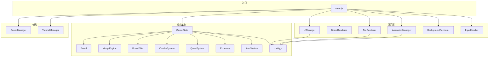
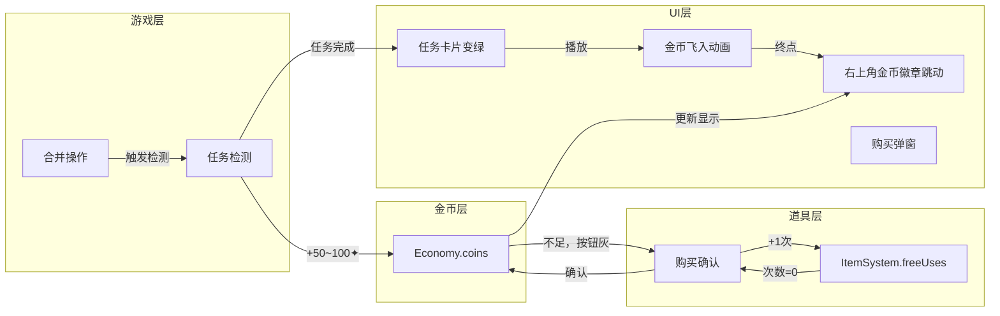

# 星图能量网 — 系统架构 & 数据流

## 1. 模块依赖图



## 2. 主循环数据流

```mermaid
sequenceDiagram
    participant User as 用户
    participant IH as InputHandler
    participant Main as main.js
    participant GS as GameState
    participant ME as MergeEngine
    participant AM as AnimationManager
    participant UM as UIManager

    User->>IH: 点击棋盘 (screenX, screenY)
    IH->>IH: screen → design → 棋盘局部坐标
    IH->>Main: handleTap(row, col)
    
    Main->>Main: 检查 tutorial.isActive / inputLocked
    Main->>GS: board.get(row, col)
    Main->>ME: findConnectedGroup(board, row, col)
    
    alt 无有效组
        ME-->>Main: null
        Main->>AM: playInvalidFeedback()
    else 有效组
        Main->>TR: highlightGroup()
        Main->>GS: tap(row, col)
        
        rect rgb(20, 30, 50)
            Note over GS: 合并执行
            GS->>ME: executeMerge()
            GS->>CS: recordMerge()
            GS->>BF: fillAfterMerge()
            GS->>GS: deadlock check
            GS->>QS: update() → onComplete (coins)
            GS->>GS: victory check
        end
        
        GS-->>Main: timeline { group, movements, newTiles, ... }
        Main->>AM: playMergeTimeline(timeline)
        
        Note over AM: 吸附(200ms) → 升级(320ms) → 下落补块(500ms)
        
        Main->>UM: update(state)
        UM->>UM: score animation + quest update + combo refresh
        
        alt timeline.gameOver (victory)
            Main->>UM: showResult(victory)
        else timeline.gameOver (deadlock)
            Main->>TM: showDeadlockHint?
            Main->>UM: showResult(deadlock)
        end
    end
```



## 3. 经济闭环数据流



## 4. 结局判定流程

```mermaid
flowchart TD
    MERGE[每次合并后] --> D1{死局检测}
    D1 -->|有可合并组| Q{任务检测}
    D1 -->|无, 重试3次后| DEADLOCK[死局结算]
    
    Q --> Q2{3个任务全完成?}
    Q2 -->|是| VICTORY[胜利结算]
    Q2 -->|否| FILL[补新任务]
    FILL --> CONTINUE[游戏继续]
    
    DEADLOCK --> RESULT[显示结算画面]
    VICTORY --> RESULT
    
    RESULT --> REPLAY[玩家点"再来一局"]
    REPLAY --> NEWGAME[newGame → 重置棋盘]
```

## 5. 关键数据结构

### Timeline（tap 返回值）

```js
{
  group: [{ row, col, tileId, value }],  // 合并组快照
  targetRow, targetCol,                   // 落点
  absorbedTileIds: [id1, id2, ...],       // 被吸入的 tile
  upgradedTileId: number,                 // 升级的 tile
  resultValue: number,                    // 升级后的值
  groupSize: number,
  finalScore: number,
  comboCount: number, comboMult: number,
  movements: [{ tileId, fromRow, toRow, col }],
  newTiles: [{ tileId, row, col, value }],
  completedQuests: [Quest],
  gameOver: boolean,
}
```

### Stats（任务检查用）

```js
{
  maxTile: number,          // 当前最高数字
  score: number,            // 当前分数
  bigMergeCount4: number,   // ≥4 格合并次数
  bigMergeCount6: number,   // ≥6 格合并次数
  totalMerges: number,      // 总合并次数
  maxCombo: number,         // 最高连击数
  shuffleUsed: boolean,     // 是否使用过重洗
  mergesAfterShuffle: number, // 重洗后合并次数
}
```
